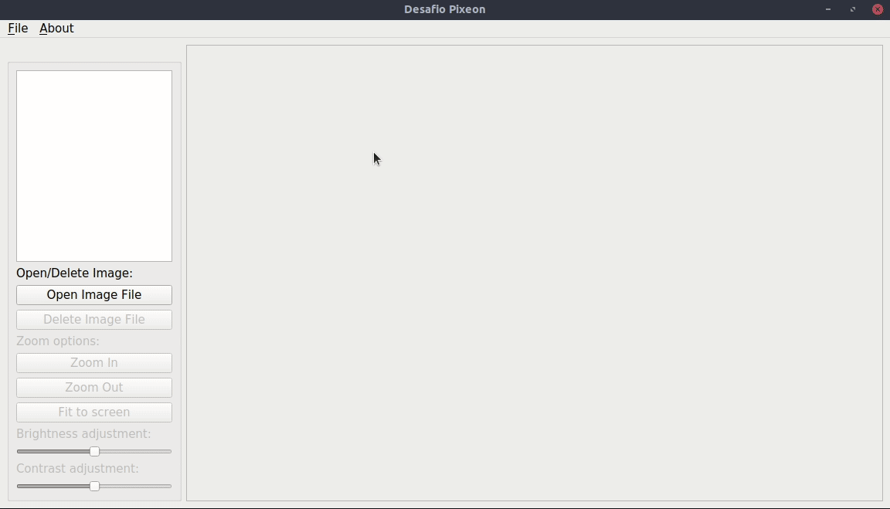

# Desafio Pixeon

Este projeto faz parte do processo seletivo para o cargo de Desenvolvedor C++ da **[Pixeon](https://www.pixeon.com/)**.

A avaliação consiste em desenvolver um visualizador de imagens utilizando o framework **[Qt](https://www.qt.io/)**.

O resultado é descrito abaixo.

## Resultado

A interface gráfica conta com quatro elementos principais: uma barra de menu ao topo, uma lista para seleção de arquivos
no canto esquerdo-superior, um painel de controle no canto esquerdo-inferior e uma área de exibição de imagem à direita. 

A animação a seguir mostra um exemplo de uso deste programa:

### Comportamentos
#### Geral
- O programa é inicializado sem nenhum arquivo carregado. Para carregar uma imagem clique no botão **Open Image File**,
  ou em **File -> Open Image File**.
 - Na barra de menu há um item para exibir as informações sobre este programa, com o título de **About**.
 - O programa é configurado para ler imagens BMP, PNG e JPEG.
- Vários arquivos podem ser carregados, mas apenas um é exibido por vez.
- Ao carregar um novo arquivo, a imagem é atualizada.
- Os nomes dos arquivos abertos são inseridos na lista. Um duplo clique sobre um item da lista altera o arquivo exibido.
- Por razões estéticas, a lista exibe apenas o nome do arquivo, e não seu caminho absoluto. Se um usuário tenta abrir
 um arquivo de mesmo nome, mas de diretórios diferentes, ele é avisado que isto não é possível através de uma caixa
  de mensagem. Este comportamento é mencionado na seção **Futuras melhorias**.
- O botão **Delete Image File** remove o arquivo selecionado da lista e muda a exibição para o próximo arquivo
  selecionado, se existir. Caso contrário, a tela inicial é exibida.
- Se nenhum arquivo é selecionado, o botão **Delete Image Files** remove todas as imagens. Este comportamento é
  mencionado na seção **Futuras melhorias**.
  
#### Processamento de imagem
  - Os controles de processamentos de imagens só são ativados se há pelo menos uma imagem carregada.
  - Quando o arquivo é exibido, seu tamanho é modificado para que ocupe toda a área de exibição,
  preservando suas proporções.
  - O _zoom_ do arquivo pode ser alterado através dos botões **Zoom In** e **Zoom Out**.
  O botão **Fit to screen** restaura o tamanho da imagem para que ocupe toda a área de exibição.
  - Os ajustes de brilho e contraste são configurados através dos seus respectivos _sliders_.
  - Quando o arquivo a ser exibido é alterado, os controles voltam para o valor padrão.
  

## Detalhes de implementação

As seguintes classes foram criadas:

- `PXMainWindow`: responsável pela organização dos componentes gráficos e pelo recebimento dos comandos do usuário.

- `PXRenderThread`: responsável pelas operações de processamento da imagem: zoom, alteração de brilho e contraste.

A exibição de imagem ocorre dentro de um _widget_ `QLabel`, que por sua vez é exibido dentro de um `QScrollArea`.
Modificações nas imagens ocorre através do redimensionamento do objeto `QLabel` e da atualização de seu `QPixmap`
 através de chamadas aos métodos `QLabel::resize` e `QLabel::setPixmap` respectivamente.
 O objeto `QScrollArea` faz parte do layout central da `PXMainWindow`.
 
Ao carregar uma imagem, uma cópia do seu `QPixmap` original é armazenada na estrutura de dados 
do objeton `PXMainWindow`. Toda alteração é feita a partir do `QPixmap` original, para evitar que
edições se acumulem. Por exemplo, se a imagem original não fosse armazenada de alguma forma, 
reduzir muito o _zoom_ de uma imagem e então clicar no botão **Fit to screen** tornaria a imagem esmaecida.

A estrutura de dados da classe `PXMainWindow` armazena os valores atualizados dos fatores de 
escala, brilho e contraste nos membros `m_scale_factor`, `m_brightness_factor` e `m_contrast_factor`
e um objeto `PXRenderThread`.
 
Cada vez que o usuário demanda uma mudança na imagem, a _render thread_ é acionada, passando
`m_scale_factor`, `m_brightness_factor`, `m_contrast_factor` e uma referência ao `QPixmap` original como parâmetro.
A imagem renderizada é retornada através de um novo `QPixmap`, enviado através de um `signal` que se
conecta num `slot` da classe _main window_ responsável por atualizar a exibição de imagem.
Apesar das operações de processamento serem leves, isto evita que a interface gráfica
fique bloqueada a novos comandos enquanto espera uma imagem ser renderizada.

## Futuras melhorias
- No momento, não há testes de integração e unitários. Implementá-los é uma tarefa de muita importância para 
garantir segurança perante mudanças no código.
- O programa deve ser testado com address/UB sanitizers e analisadores estáticos (clang-tidy/cppcheck).
- O programa foi compilado numa única máquina Linux (Ubuntu 20.04), versão de Qt 5.12.8 e compilado com GCC 9.4. 
 Testes devem ser feitos para garantir funcionamento em outros sistemas/versões.
- As funções _rotate_ e _pan_ não foram implementadas por questões de prazo e podem ser criadas futuramente.
- Apesar do comportamento de remover todas as imagens se nenhuma é selecionada não ser exatamente um _bug_,
não é intuitivo para o usuário que isso aconteça e poderia ser removido em futuras versões.
- O comportamento de impedir que duas imagens com o mesmo nome sejam abertas não é o melhor em termos de _user experience_.
Opções para lidar com esse caso seriam acrescentar um sufixo no nome do arquivo para diferenciação ou então 
um _alt text_ sobre o item da lista indicando o caminho completo do arquivo.
- Cada vez que um item da lista é selecionado, a imagem é carregada do sistema novamente através de seu caminho completo.
Isto gera um erro se o usuário remove a imagem do sistema durante a execução do programa.
Esta situação deve ser lidada corretamente ao carregar o arquivo para que o nome de um arquivo inexistente não permaneça na lista de arquivos.
- Pesquisar se há espaço para otimização nos algoritmos de ajuste de brilho e contraste.
